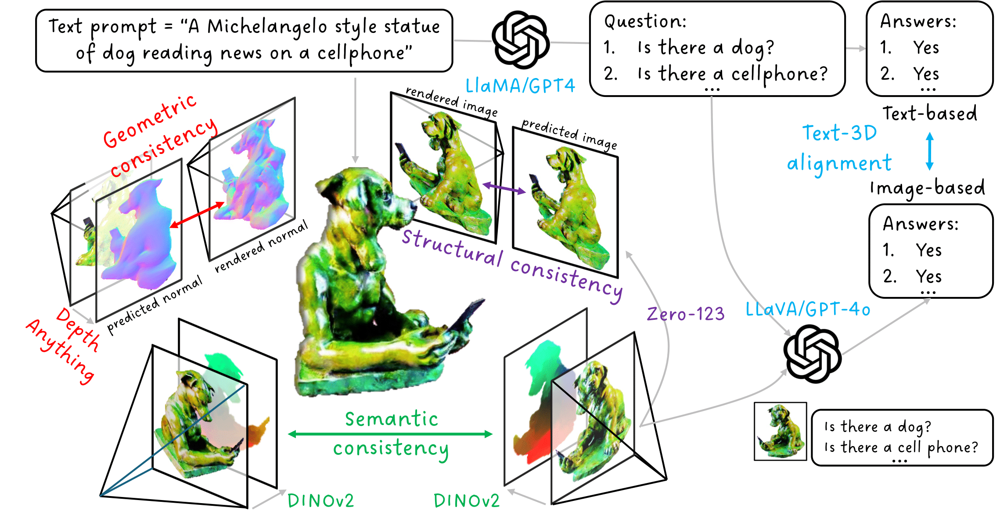

# Eval3D: Interpretable and Fine-grained Evaluation for 3D Generation 

This is the code repository of the paper: 

> [Eval3D: Interpretable and Fine-grained Evaluation for 3D Generation]()  
> Shivam Duggal*, Yushi Hu*, Oscar Michel, Aniruddha Kembhavi, William T. Freeman, Noah A. Smith, Ranjay Krishna, Antonio Torralba, Ali Farhadi, Wei-Chiu Ma  

## Table of Content
[Abstract](#Abstract)  
[Overview](#Overview)  
[Setup](#Setup)   
[3D Asset Generation](#3DAssetGeneration)   
[Geometric Consistency Metric](#GeometricConsistencyMetric)  
[Structural Consistency Metric](#StructuralConsistencyMetric)  
[Semantic Consistency Metric](#SemanticConsistencyMetric)  
[Aesthetics Metric](#AestheticsMetric)  
[Text-3D Alignment Metric](#Text3DAlignmentMetric)  
[Citation](#Citation)  

<a name="Abstract"></a>
## Abstract

<div style="text-align: justify;">
Despite the unprecedented progress in the field of 3D generation, current systems still often fail to produce high-quality 3D assets that are visually appealing and geometrically and semantically consistent across multiple viewpoints. To effectively assess the quality of the generated 3D data, there is a need for a reliable 3D evaluation tool. Unfortunately, existing 3D evaluation metrics often overlook the geometric quality of generated assets or merely rely on black-box multimodal large language models for coarse assessment. In this paper, we introduce Eval3D, a fine-grained, interpretable evaluation tool that can faithfully evaluate the quality of generated 3D assets based on various distinct yet complementary criteria. Our key observation is that many desired properties of 3D generation, such as semantic and geometric consistency, can be effectively captured by measuring the consistency among various foundation models and tools. We thus leverage a diverse set of models and tools as probes to evaluate the inconsistency of generated 3D assets across different aspects. Compared to prior work, Eval3D provides pixel-wise measurement, enables accurate 3D spatial feedback, and aligns more closely with human judgments. We comprehensively evaluate existing 3D generation models using Eval3D and highlight the limitations and challenges of current models.
</div>

<a name="Overview"></a>
## Overview
Eval3D offers *interpretable, fine-grained, and human-aligned metrics* to assess the quality of 3D generations from various aspects –– **Geometric consistency, Semantic Consistency, Structural Consistency, Text-3D Alignment, Aesthetics**
We utilize a diverse array of *foundation models* and tools to measure the *consistency among different representations of generated 3D assets*.




<a name="Setup"></a>
## Setup

```bash
conda create -n eval3d python=3.8  
conda activate eval3d  
conda install -c conda-forge ninja cxx-compiler==1.3.0  
conda install cuda -c nvidia/label/cuda-11.8.0  
conda install pytorch==2.1.0 torchvision==0.16.0 torchaudio==2.1.0 pytorch-cuda=11.8 -c pytorch -c nvidia  
pip install git+https://github.com/NVlabs/tiny-cuda-nn.git#subdirectory=bindings/torch  
pip install -r requirements.txt  
conda install pytorch3d==0.7.5 -c pytorch3d
```

Installing tiny-cuda-nn can be challenging. If you face missing `libcuda.so` error (`-lcuda`), then first finding the path to `libcuda.so` and linking that via `LIBRARY_PATH`` could be useful.

**Example:**
```bash
find /usr -name 'libcuda.so*' 2>/dev/null   
LIBRARY_PATH="/usr/lib/x86_64-linux-gnu:$LIBRARY_PATH" pip install git+https://github.com/NVlabs/tiny-cuda-nn.git#subdirectory=bindings/torch
```

**For semantic consistency metric**: 
```bash
cd Eval3D/semantic_consistency  
git clone https://github.com/mhamilton723/FeatUp.git  
cd FeatUp  
pip install -e .  
```

**For structural consistency metric**:  

Download pretrained Stable Zero123 checkpoint ```stable-zero123.ckpt``` into ```Generate3D/threestudio/load/zero123``` from https://huggingface.co/stabilityai/stable-zero123

**For text-3D alignment**:

To use OpenAI API models for VQA, you need to set up the OpenAI API key.
```bash
pip install openai

export OPENAI_API_KEY=[YOUR OPENAI KEY]
```

**For Aesthetics**:
```bash
pip install image-reward
```

<a name="Data"></a>
## Data

We share the list of prompts used for text-3D evaluation –– <a href="data/prompt_library.json">Full Prompt List</a>, <a href="data/selected_prompt_ids.json">Prompt IDs used</a>


<a name="3DAssetGeneration"></a>
## 3D Asset Generation

- Eval3D is flexible enough to evaluate 3D assets generated by any means. In this study, we leverage the Threestudio library to generate 3D assets based on text or text + image user queries.
- All Eval3D metrics assume the same 3D metadata structure format as generated by Threestudio. For 3D data generated through other methods, you can either modify the Eval3D metric codes to accept the new input format or align your data to match the Threestudio generation format.


```bash
## Generates 3D asset for 1st prompt of the prompt-library using dreamfusion.
cd Generate3D/threestudio  
python run_threestudio.py --algorithm_name dreamfusion_if --prompt_idx 0 --gpu_id 3

## Alternate Option -- directly provide the prompt
cd Generate3D/threestudio  
python run_threestudio.py --algorithm_name dreamfusion_if --prompt "a zoomed out DSLR photo of a monkey riding a bike" --gpu_id 3
```

- ```run_threestudio``` current supports following algorithm_name: ```dreamfusion_if, textmesh_if, prolificdreamer, prolificdreamer_geometry, prolificdreamer_texture, magic3d_coarse_if, magic3d_refine_sd```. ProlificDreamer and Magic3D are multi-stage algorithms, thus require iterative execution.
- Feel free to generate 3D assets using any of the threestduio implemented algorithms -- <a href="https://github.com/threestudio-project/threestudio">threestudio implementations</a>. For example, for MVDream, we used <a href="https://github.com/DSaurus/threestudio-mvdream">threestudio-custom-mvdream</a>.

All the generated data is available at: "Generate3D/threestudio/outputs". Set the ```$DATA_PATH``` as following to evaluate the metrics.

```bash
export DATA_PATH="$(pwd)/Generate3D/threestudio/outputs"
```

We provide some exemplar 3D mesh and corresponding metadata (rendered images, normals and opacity maps) here – [**Exemplar 3D Data**](https://www.dropbox.com/home/Shivam%20Duggal/eval3d-cvpr-2025). Download these and move them under $DATA_PATH and then run the following Eval3D metric commands.

<a name="GeometricConsistencyMetric"></a>
## Geometric Consistency Metric


- The Geometric Consistency Metric involves comparing geometrically generated surface normals (from 3D generations or meshes) with image-based predictions of normals.
- The first step is to pass the rendered RGB images through a depth/normal estimation algorithm. We leverage DepthAnything to generate depth maps, which are then mapped to normals. You are welcome to use other methods for normal generation. Once the depth maps are generated, we compute the geometric consistency metric.

<br>

```bash
cd Eval3D/geometric_consistency  
python run_depth_anything.py --base_dir $DATA_PATH --algorithm_name dreamfusion-if --start_idx 0 --end_idx 1000 --num_gpus 8 --available_gpus "0,1,2,3,4,5,6,7"  # Generates depth maps for all views for all assets inside dreamfusion folder.
```

Evaluating geometric consistency for **all prompt generations of a particular algorithm**:
```bash
cd Eval3D/geometric_consistency 
python evaluate.py --base_dir $DATA_PATH --algorithm_name dreamfusion-if  
```

<a name="StructuralConsistencyMetric"></a>
## Structural Consistency Metric


<br>

Evaluating structural consistency for a **single prompt generation**:

```bash 
cd Eval3D/structural_consistency 
python evaluate.py --prompt_id a_20-sided_die_made_out_of_glass@20241017-143548 --base_data_path $DATA_PATH --algorithm_name dreamfusion-if  
```


Evaluating structural consistency for **all prompt generations of a particular algorithm**:

```bash
cd Eval3D/structural_consistency 
python evaluate.py --base_data_path $DATA_PATH --algorithm_name dreamfusion-if
```

Generated data / outputs are saved at: ```$DATA_PATH/mvimg-gen-zero123-sai``` –– ```structural_consistency_outputs```

<a name="SemanticConsistencyMetric"></a>
## Semantic Consistency Metric


<br>

Evaluating semantic consistency for a **single prompt generation**:

```bash
cd Eval3D/semantic_consistency
python evaluate.py --prompt_id a_20-sided_die_made_out_of_glass@20241017-143548 --base_data_path $DATA_PATH --algorithm_name dreamfusion-if
```

Evaluating semantic consistency for **all prompt generations of a particular algorithm**:

```bash
cd Eval3D/semantic_consistency
python evaluate.py --base_data_path $DATA_PATH --algorithm_name dreamfusion-if
```

Generated data / outputs are inside the corresponding prompt folders in $DATA_PATH –– ```semantic_consistency_outputs, all_dino_feats, all_pca_dino_feats, model.obj, model.mtl``` 

<a name="AestheticsMetric"></a>
## Aesthetics Metric

The input is a video file for the 3D asset. A sample file is in `Eval3D/aesthetics_metric/a_corgi_taking_a_selfie.mp4`

To compute the aesthetics score given by image-reward:

```bash
cd Eval3D/aesthetics_metric
python evaluate.py --video a_corgi_taking_a_selfie.mp4
```

You can also refer to the notebook `Eval3D/aesthetics_metric/example.ipynb`

<a name="Text3DAlignmentMetric"></a>
## Text-3D Alignment Metric

The input is a video file for the 3D asset (e.g., `Eval3D/text_3D_alignment/a_corgi_taking_a_selfie.mp4`) and the corresponding evaluation questions (e.g., `Eval3D/text_3D_alignment/sample_questions.json`).

We pre-generated the questions for prompts in our benchmark in `data/3dprompts_with_questions.json`.

You can customize the multimodal LM for evaluation. Please refer to [text_3D_alignment/README.md](Eval3D/text_3D_alignment/README.md)

**DISCLAIMER:** Eval3D is an early effort towards developing interpretable, human-aligned 3D asset evaluation. We acknowledge that the proposed metrics are not flawless (as is the case with most metrics) and may have some limitations. The goal of this repository is to inspire further research and advancements in this area.

<a name="Citation"></a>
## Citation

```bibtex
@article{eval3d2024,
    title={Eval3D: Interpretable and Fine-grained Evaluation for 3D Generation},
    author={Duggal, Shivam and Hu, Yushi and Michel, Oscar and Kembhavi, Aniruddha and Freeman, William T. and Smith, Noah A. and Krishna, Ranjay and Torralba, Antonio and Farhadi, Ali and Ma, Wei-Chiu},
    journal={arXiv preprint},
    year={2024},
}
```
