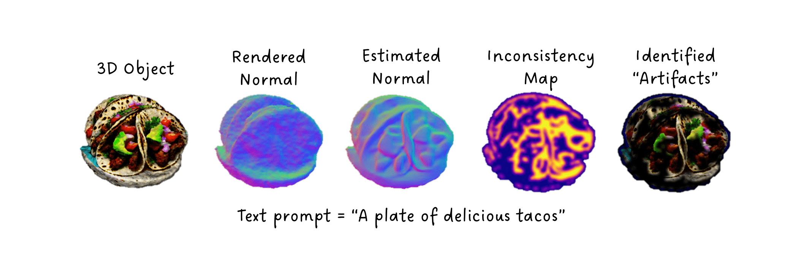
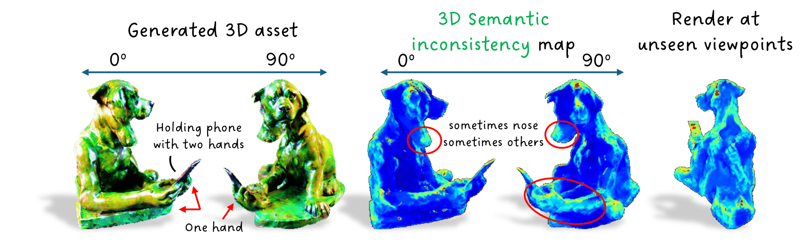
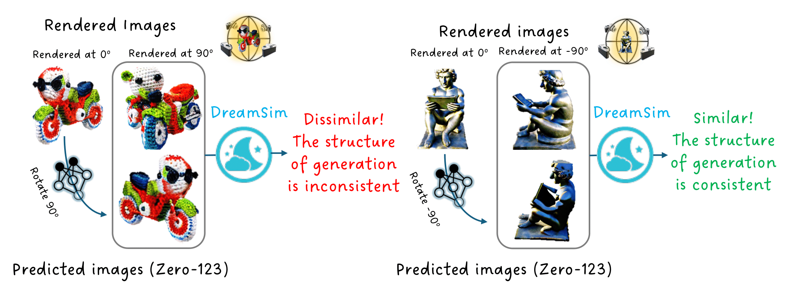

# Eval3D Pipeline: Complete 3D Asset Evaluation System

> **Based on this original repo [Eval3D: Interpretable and Fine-grained Evaluation for 3D Generation](https://github.com/eval3d/eval3d-codebase)**  
> Original paper by Duggal et al. | CVPR 2025

---

## 🎯 What This Repository Provides

This repository extends the original Eval3D research codebase into a **production-ready pipeline** that can evaluate **ANY 3D mesh file** with comprehensive metrics. While the original Eval3D was designed for threestudio-generated assets, this pipeline makes it work with meshes from any source.

### Key Features

✅ **Universal Mesh Support** - Evaluate `.obj`, `.glb`, `.ply`, `.stl`, `.obx` files from any 3D generator  
✅ **Automated Pipeline** - Single command: mesh in → scores out  
✅ **5 Comprehensive Metrics** - Geometric, Semantic, Structural, Aesthetic, and Text-3D alignment  
✅ **No Threestudio Required** - Automatically generates all required intermediate data  
✅ **CLI Interface** - Simple commands for quick evaluation  
✅ **Batch Processing** - Evaluate multiple assets efficiently  

---

## 📁 Repository Structure

```
Eval3d_pipline/
├── eval3d-pipeline/        # 🆕 Production pipeline wrapper (CLI tool)
│   ├── src/
│   │   └── eval3d_pipeline/
│   │       ├── cli.py                 # Command-line interface
│   │       ├── render_asset.py        # Mesh rendering engine
│   │       ├── asset_preparation.py   # Data format converter
│   │       └── metrics/               # Metric implementations
│   │           ├── geometric.py       # Geometric consistency
│   │           ├── semantic.py        # Semantic consistency
│   │           ├── structural.py      # Structural consistency
│   │           ├── aesthetics.py      # Aesthetic quality
│   │           └── text3d.py          # Text-3D alignment
│   ├── pyproject.toml
│   └── README.md
│
├── Eval3D/                 # Original Eval3D research code
│   ├── geometric_consistency/
│   ├── semantic_consistency/
│   ├── structural_consistency/
│   ├── aesthetics/
│   └── text_3D_alignment/
│
├── Generate3D/             # 3D generation tools (threestudio)
│   └── threestudio/
│
└── data/                   # Benchmark prompts and questions
    ├── prompt_library.json
    └── 3dprompts_with_questions.json
```

---

## 🚀 Quick Start

### Installation

```bash
# Clone this repository
git clone https://github.com/chengjiafeng857/Eval3d_pipline.git
cd Eval3d_pipline/eval3d-pipeline

# Install with uv (recommended)
uv sync

# Install rendering dependencies
uv pip install trimesh pyrender opencv-python PyOpenGL numpy Pillow torch

# For semantic consistency (FeatUp)
cd ../Eval3D/semantic_consistency
git clone https://github.com/mhamilton723/FeatUp.git
cd FeatUp && pip install -e .

# For text-3D alignment (OpenAI API)
export OPENAI_API_KEY=your_key_here
```

### Basic Usage

```bash
# Evaluate a single mesh with all metrics
cd eval3d-pipeline
uv run eval3d-pipeline eval-mesh ./robot.obj \
    --algo my_method \
    --prompt "a robot holding a sword"

# Quick evaluation (aesthetics + text-3D only)
uv run eval3d-pipeline eval-mesh ./model.obj --quick

# Specific metrics only
uv run eval3d-pipeline eval-mesh ./model.obj \
    -m geometric -m semantic -m aesthetics
```

### Example Output

```
🎨 Eval3D Pipeline Results
━━━━━━━━━━━━━━━━━━━━━━━━━━━━━━━━━━━━━━━━━━━━━━━━━━━━━━━━━━━━━━

Asset: robot_holding_sword
Algorithm: my_method

┏━━━━━━━━━━━━━━━━━━━━━━━┳━━━━━━━━━━━┳━━━━━━━━━━━━━━━━━━━━━━━━┓
┃ Metric                ┃ Score     ┃ Interpretation         ┃
┡━━━━━━━━━━━━━━━━━━━━━━━╇━━━━━━━━━━━╇━━━━━━━━━━━━━━━━━━━━━━━━┩
│ Geometric Consistency │ 87.34     │ ✅ Excellent           │
│ Semantic Consistency  │ 82.15     │ ✅ Good                │
│ Aesthetics            │ 0.78      │ ✅ High Quality        │
│ Text-3D Alignment     │ 0.85      │ ✅ Strong Match        │
│ Structural Consist.   │ N/A       │ ⚠️  Zero123 not setup  │
└───────────────────────┴───────────┴────────────────────────┘

Results saved to: ./data/my_method/robot/eval3d_scores.json
```

---

## 📊 Understanding the Metrics

### 1. **Geometric Consistency** (Higher is Better, 0-100)

**What it measures:** Alignment between rendered surface normals and depth-predicted normals

**How it works:**
1. Renders your mesh from 120 viewpoints, computing true surface normals
2. Passes RGB renders through DepthAnything to predict depth maps
3. Converts predicted depth to normals
4. Compares geometric vs predicted normals (cosine similarity)

**Good scores:** 85+ indicates excellent texture-geometry alignment  
**Poor scores:** <60 suggests texture conflicts with geometry (e.g., painted-on details that aren't 3D)



---

### 2. **Semantic Consistency** (Higher is Better, 0-100)

**What it measures:** Visual identity consistency across different viewpoints

**How it works:**
1. Extracts DINO features from rendered images
2. Projects features onto 3D mesh vertices
3. Measures feature variance for each vertex across views
4. Low variance = consistent identity; High variance = Janus problem

**Good scores:** 80+ means the object looks like the same thing from all angles  
**Poor scores:** <65 indicates multi-face problem (looks like different objects from different views)

**Example problems detected:**
- Two-headed characters
- Front shows a cat, back shows a dog
- Texture/identity drift around the object



---

### 3. **Structural Consistency** (Higher is Better, 0-100)

**What it measures:** Novel view synthesis quality using Zero123

**How it works:**
1. Takes one rendered view as input
2. Asks Zero123 to generate what the object should look like from different angles
3. Compares Zero123's predictions with actual renders
4. High LPIPS distance = structural inconsistency

**Requirements:** Requires downloading Stable Zero123 checkpoint (3GB+)  
**Good scores:** 75+ indicates predictable, consistent 3D structure  
**Poor scores:** <55 suggests surprising or inconsistent geometry



---

### 4. **Aesthetics** (Higher is Better, 0-1)

**What it measures:** Visual appeal and image quality

**How it works:**
1. Renders turntable video of the 3D asset
2. Extracts frames (every 4th frame)
3. Scores each frame with ImageReward (BLIP + human preference fine-tuning)
4. Returns average score

**Good scores:** 0.7+ is high quality, visually appealing  
**Poor scores:** <0.4 suggests low visual quality, artifacts, or poor lighting

**What affects the score:**
- Clean textures
- Good lighting and shading
- Realistic materials
- No visible artifacts or holes

---

### 5. **Text-3D Alignment** (Higher is Better, 0-1)

**What it measures:** How well the 3D asset matches the text prompt

**How it works:**
1. Generates 5-10 yes/no questions about the prompt (e.g., "Is there a robot?", "Is it holding a sword?")
2. Shows turntable video frames to GPT-4o
3. GPT-4o answers each question
4. Score = fraction of "yes" answers

**Good scores:** 0.8+ means strong text adherence  
**Poor scores:** <0.5 indicates missing or incorrect semantic content

**Example questions for "a robot holding a sword":**
- Is there a robot visible in the images?
- Is the robot holding an object?
- Is the object a sword or blade?
- Does the robot appear to be gripping the sword?

---

## 🔧 Advanced Usage

### Batch Evaluation

```bash
# Evaluate multiple meshes
for mesh in ./meshes/*.obj; do
    uv run eval3d-pipeline eval-mesh "$mesh" \
        --algo my_method \
        --prompt "$(basename $mesh .obj)"
done

# Generate summary report
uv run eval3d-pipeline summarize ./data/my_method/
```

### Prepare Data Without Evaluation

```bash
# Generate all Eval3D-compatible data structure
uv run eval3d-pipeline prepare-mesh ./model.obj \
    --algo my_method \
    --full

# This creates:
# data/my_method/model/
#   ├── save/it0-test/
#   │   ├── rgb_images/        # 120 rendered RGB views
#   │   ├── normal_world/      # Surface normals (.npy)
#   │   ├── opacity/           # Alpha masks
#   │   └── batch_data/        # Camera parameters (.npy)
#   ├── video/
#   │   └── turntable.mp4
#   └── model.obj
```

### Use Original Eval3D Scripts

```bash
# After preparing your mesh, you can use the original scripts
export DATA_PATH="./data"

cd Eval3D/geometric_consistency
python evaluate.py --base_dir $DATA_PATH --algorithm_name my_method

cd ../semantic_consistency
python evaluate.py --base_data_path $DATA_PATH --algorithm_name my_method
```

---

## 🏗️ How the Pipeline Works

### The Key Innovation

The original Eval3D expected data in threestudio's internal format:
```
output/<algorithm>/<prompt>/
  save/it0-test/
    rgb_images/
    normal_world/
    opacity/
    batch_data/      # ← Camera parameters from threestudio's training
```

**Problem:** This format only existed for threestudio-generated assets.

**Solution:** This pipeline **generates all required data** from just a mesh file by:

1. **Rendering with known camera parameters** (same math as threestudio)
2. **Computing surface normals** in world space during rendering
3. **Saving camera matrices** in the exact format Eval3D expects
4. **Creating opacity masks** from alpha channel
5. **Rendering turntable video** for aesthetic/text-3D metrics

### Camera Parameter Format

Each `batch_data/*.npy` file contains:
```python
{
    "c2w": np.array([4, 4]),           # Camera-to-world matrix
    "proj_mtx": np.array([4, 4]),      # Projection matrix
    "mvp_mtx": np.array([4, 4]),       # Model-view-projection
    "elevation": float,                 # Camera elevation (degrees)
    "azimuth": float,                   # Camera azimuth (0-360°)
    "camera_distances": float,          # Distance from origin
    "fovy": float,                      # Field of view (degrees)
    "height": int, "width": int,
}
```

These are computed using the same orbit camera math as threestudio's `uncond.py` dataloader.

---

## 🎓 Understanding the Methodology

### Multi-Model Consistency Framework

Eval3D's core insight: **High-quality 3D assets should be consistent when analyzed by different foundation models and tools.**

Instead of training a single "3D quality predictor," Eval3D uses:

| Metric | Models/Tools Used | Consistency Measured |
|--------|------------------|---------------------|
| Geometric | Mesh Renderer + DepthAnything | Geometric normals ↔ Depth normals |
| Semantic | DINO (ViT-B/14) + FeatUp | Feature identity across views |
| Structural | Zero123 (novel view synthesis) | Predicted views ↔ Actual views |
| Aesthetics | ImageReward (BLIP + RLHF) | Human preference alignment |
| Text-3D | GPT-4o (VLM) | Language ↔ Visual content |

### Why This Works

1. **Interpretable:** Each metric measures a specific failure mode
2. **Fine-grained:** Provides pixel/vertex-level feedback (not just a single score)
3. **Human-aligned:** Correlates strongly with human quality judgments
4. **Complementary:** Different metrics catch different problems

---

## 📦 Dependencies

### Core Pipeline
- Python 3.10+
- PyTorch 2.1.0+
- trimesh, pyrender (rendering)
- numpy, opencv-python

### Metric-Specific
- **Geometric:** DepthAnything (auto-downloaded)
- **Semantic:** FeatUp, DINO (auto-downloaded)
- **Structural:** Stable Zero123 checkpoint (manual download, 3GB)
- **Aesthetics:** ImageReward (auto-downloaded)
- **Text-3D:** OpenAI API key

### Full Installation (Research Setup)

For the complete original Eval3D setup with all dependencies:

```bash
conda create -n eval3d python=3.10
conda activate eval3d
conda install pytorch==2.1.0 torchvision==0.16.0 pytorch-cuda=11.8 -c pytorch -c nvidia
pip install -r requirements.txt
conda install pytorch3d==0.7.5 -c pytorch3d

# For structural consistency
cd Generate3D/threestudio/load/zero123
wget https://huggingface.co/stabilityai/stable-zero123/resolve/main/stable_zero123.ckpt
```

---

## 🐛 Troubleshooting

### Rendering Issues

**"Could not create GL context"** (headless servers)
```bash
# Install OSMesa for software rendering
apt-get install libosmesa6-dev freeglut3-dev
export PYOPENGL_PLATFORM=osmesa
```

**"Mesh appears black or has no texture"**
- Make sure your .obj has corresponding .mtl and texture files
- Try: `uv run eval3d-pipeline prepare-mesh ./model.obj --visualize`

### Metric Failures

**Geometric/Semantic metrics fail**
```bash
# Make sure batch_data was generated
ls data/my_method/model/save/it0-test/batch_data/

# If empty, re-run with --full flag
uv run eval3d-pipeline prepare-mesh ./model.obj --full
```

**Text-3D returns "Error: API key not set"**
```bash
export OPENAI_API_KEY=sk-...
```

**Structural consistency always returns N/A**
- This metric requires Zero123 setup (optional)
- Download checkpoint and install dependencies
- See: [Eval3D/structural_consistency/README.md](Eval3D/structural_consistency/README.md)

---

## 📚 Citation

If you use this pipeline, please cite the original Eval3D paper:

```bibtex
@article{eval3d2024,
    title={Eval3D: Interpretable and Fine-grained Evaluation for 3D Generation},
    author={Duggal, Shivam and Hu, Yushi and Michel, Oscar and Kembhavi, Aniruddha and Freeman, William T. and Smith, Noah A. and Krishna, Ranjay and Torralba, Antonio and Farhadi, Ali and Ma, Wei-Chiu},
    journal={CVPR},
    year={2025},
}
```

---

## 🙏 Acknowledgments

- **Original Eval3D Team** for the foundational research and metrics
- **threestudio** for the 3D generation framework
- **DepthAnything, DINO, Zero123, ImageReward** for foundation models

---

## 📄 License

This project extends the original Eval3D codebase. Please refer to the original repository for license details.

---

## 🔗 Links

- **Original Eval3D Repository:** https://github.com/eval3d/eval3d-codebase
- **Original Paper:** [Eval3D: Interpretable and Fine-grained Evaluation for 3D Generation](https://arxiv.org)
- **threestudio:** https://github.com/threestudio-project/threestudio
- **Issues & Questions:** [GitHub Issues](https://github.com/chengjiafeng857/Eval3d_pipline/issues)

---

## 🚧 Disclaimer

Eval3D is an early effort towards developing interpretable, human-aligned 3D asset evaluation. The proposed metrics have limitations and should be used as one of several evaluation tools. This pipeline aims to make these metrics more accessible while acknowledging their current constraints.
